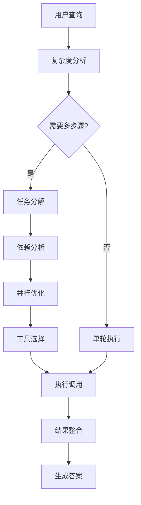
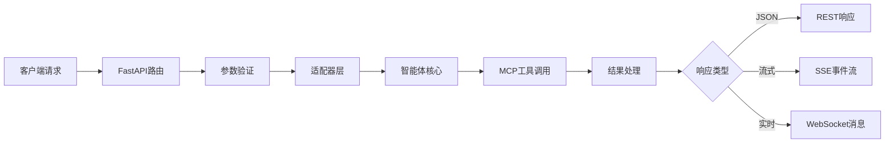
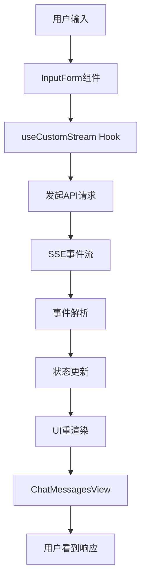

# xDAN-Agentic-Search-Test 系统架构文档

## 目录
1. [智能体架构](#1-智能体架构)
2. [API架构](#2-api架构)
3. [前端架构](#3-前端架构)

---

## 1. 智能体架构

### 1.1 概述
xDAN智能体采用模块化的分层架构设计，核心位于`architectures/standard`目录下，实现了基于MCP（Model Context Protocol）的智能工具调用系统。

### 1.2 核心组件

#### 1.2.1 智能工具选择器（Intelligent Tool Selector）

**单轮选择器（IntelligentToolSelector）**
- 基于大语言模型的智能工具选择
- 使用OpenAI API兼容接口进行决策
- 自动进行工具参数映射和验证
- 内置JSON解析器确保输出格式正确

**多轮选择器（MultiTurnToolSelector）**
- 继承并扩展单轮选择器的能力
- 支持复杂查询的智能任务分解
- 实现并行执行优化（ParallelExecutor）
- 维护上下文记忆和结果整合
- 最大轮次控制（默认5轮）防止无限循环

#### 1.2.2 MCP客户端管理器（MCPClientManager）
```python
# 核心功能
- FastMCP库连接MCP服务器
- SSE Transport通信协议
- 工具定义和参数模式缓存
- 智能重试机制（3次重试，2秒间隔）
- 严格的参数验证和清理
```

#### 1.2.3 并行执行器（ParallelExecutor）
- **任务依赖分析**：使用NetworkX构建依赖图
- **拓扑排序**：确定任务执行顺序
- **并发控制**：Semaphore限制并发数
- **循环检测**：防止任务间循环依赖
- **性能优化**：基于依赖层级的并行执行

#### 1.2.4 适配器层（Adapters）
**XDANLangGraphAdapter**
- xDAN后端到LangGraph兼容接口的转换
- 事件流的实时转换和映射
- 降级模式支持（MCP服务不可用时）
- 完整的流式执行支持

**EventMapper**
- xDAN事件到LangGraph事件的映射器
- 支持多种事件类型的双向转换

### 1.3 技术栈
| 组件 | 技术选型 |
|------|---------|
| 编程语言 | Python 3.11+ |
| 异步框架 | asyncio |
| AI模型接口 | OpenAI API兼容 |
| 工具协议 | MCP (Model Context Protocol) |
| 图算法库 | NetworkX |
| 通信协议 | FastMCP with SSE Transport |

### 1.4 工作流程



1. **查询接收**：接收并解析用户查询
2. **复杂度分析**：LLM判断查询复杂度
3. **任务分解**：将复杂查询分解为可执行的子任务
4. **依赖分析**：分析任务间的依赖关系
5. **并行优化**：确定可并行执行的任务组
6. **工具选择**：为每个子任务选择最合适的MCP工具
7. **执行调用**：调用MCP工具获取数据
8. **结果整合**：LLM整合多个结果生成最终答案

---

## 2. API架构

### 2.1 概述
API层采用FastAPI框架构建，提供RESTful和WebSocket接口，支持流式响应和实时通信。

### 2.2 技术栈
- **Web框架**：FastAPI
- **异步支持**：完全异步的请求处理
- **CORS**：支持跨域请求
- **流式响应**：Server-Sent Events (SSE)
- **实时通信**：WebSocket双向通信
- **数据验证**：Pydantic模型

### 2.3 API端点设计

#### 2.3.1 RESTful接口

| 端点 | 方法 | 描述 |
|-----|------|-----|
| `/` | GET | 服务信息和版本 |
| `/health` | GET | 健康检查接口 |
| `/assistants/{id}/threads` | POST | 创建新对话线程 |
| `/assistants/{id}/threads/{tid}` | GET | 获取线程信息 |
| `/assistants/{id}/threads/{tid}/runs/stream` | POST | 流式执行查询 |
| `/assistants/{id}/threads/{tid}/history` | POST | 获取线程历史 |
| `/assistants/{id}/threads/{tid}/state` | GET | 获取线程状态 |
| `/tools/count` | GET | 获取可用工具数量 |
| `/tools/list` | GET | 列出所有可用工具 |

#### 2.3.2 WebSocket接口
- **端点**：`/ws/stream`
- **功能**：实时双向通信，支持流式查询和响应

### 2.4 数据模型

```python
# 核心数据模型（Pydantic）
class Message(BaseModel):
    type: str  # "human" or "ai"
    content: str
    id: Optional[str] = None

class RunRequest(BaseModel):
    messages: List[Message]
    initial_search_query_count: Optional[int] = 3
    max_research_loops: Optional[int] = 5
    reasoning_model: Optional[str] = None

class ThreadResponse(BaseModel):
    thread_id: str
    status: str
    created_at: str

class HealthResponse(BaseModel):
    status: str
    initialized: bool
    tools_available: int
    timestamp: str
```

### 2.5 数据流架构



### 2.6 中间件和安全
- **CORS中间件**：配置跨域访问策略
- **错误处理**：全局异常捕获和标准化错误响应
- **请求限流**：防止API滥用（可选配置）
- **日志记录**：详细的请求和响应日志

---

## 3. 前端架构

### 3.1 概述
前端采用React 19和TypeScript构建，使用Vite作为构建工具，实现了现代化的单页面应用。

### 3.2 技术栈

| 类别 | 技术选型 | 版本 |
|-----|---------|-----|
| 框架 | React | 19.x |
| 语言 | TypeScript | 5.x |
| 构建工具 | Vite | 6.3.4 |
| 样式 | Tailwind CSS | 4.1.5 |
| UI组件库 | Radix UI | latest |
| 路由 | React Router DOM | 7.5.3 |
| Markdown | react-markdown | 9.0.3 |
| 图标 | Lucide React | latest |

### 3.3 项目结构

```
frontend/
├── src/
│   ├── components/        # React组件
│   │   ├── ui/           # 基础UI组件
│   │   └── custom/       # 业务组件
│   ├── hooks/            # 自定义Hooks
│   ├── utils/            # 工具函数
│   ├── types/            # TypeScript类型定义
│   └── App.tsx           # 主应用入口
├── public/               # 静态资源
└── index.html           # HTML入口
```

### 3.4 核心组件

#### 3.4.1 应用主体（App.tsx）
- **状态管理**：使用React Hooks进行状态管理
- **路由配置**：React Router配置应用路由
- **全局样式**：Tailwind CSS提供样式系统

#### 3.4.2 自定义Hook - useCustomStream
```typescript
// 核心功能
- 管理聊天消息状态
- 处理SSE流式响应
- 实现请求中断控制（AbortController）
- 统一错误处理机制
- 消息历史管理
```

#### 3.4.3 UI组件体系
**业务组件**
- `WelcomeScreen`：欢迎界面和查询输入
- `ChatMessagesView`：聊天消息展示
- `ActivityTimeline`：执行活动时间线
- `InputForm`：查询输入表单

**基础组件（基于Radix UI）**
- Badge、Button、Card：基础交互组件
- Input、Textarea：表单输入组件
- ScrollArea、Select、Tabs：布局和导航组件

### 3.5 前端特性

#### 3.5.1 流式处理
- 实时显示AI响应流
- 支持中断正在进行的请求
- 渐进式内容渲染

#### 3.5.2 响应式设计
- 移动端优先的设计理念
- 自适应布局系统
- 触摸友好的交互

#### 3.5.3 性能优化
- 组件懒加载
- 虚拟滚动（长列表）
- 请求去重和缓存

### 3.6 开发环境配置

```javascript
// vite.config.ts 核心配置
export default {
  server: {
    port: 5173,
    proxy: {
      '/api': {
        target: 'http://localhost:8000',
        changeOrigin: true
      }
    }
  },
  resolve: {
    alias: {
      '@': '/src'
    }
  }
}
```

### 3.7 数据流和状态管理



---

## 总结

xDAN-Agentic-Search-Test采用了现代化的三层架构设计：

1. **智能体层**：模块化的AI Agent实现，支持复杂任务分解和并行执行
2. **API层**：基于FastAPI的高性能异步API，支持多种通信方式
3. **前端层**：React + TypeScript的现代化SPA，提供流畅的用户体验

整个系统具有以下特点：
- **高度模块化**：各层职责清晰，便于维护和扩展
- **异步优先**：全链路异步支持，提高系统性能
- **流式处理**：支持实时数据流，提升用户体验
- **容错设计**：多级错误处理和降级机制
- **可扩展性**：易于添加新工具和功能

这种架构设计确保了系统的高可用性、高性能和良好的开发体验。