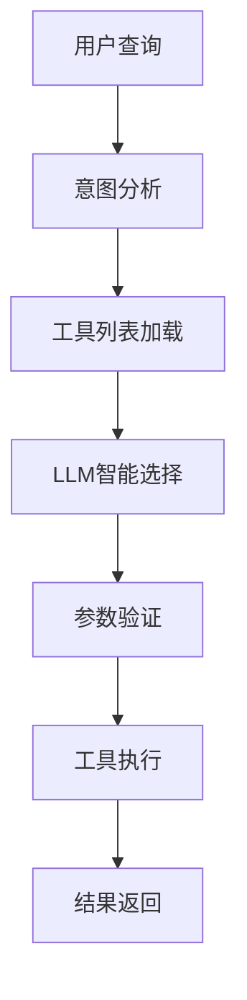

# 智能工具选择器

基于大语言模型的智能MCP工具选择系统，能够自动理解用户查询意图并选择最合适的工具。

## 🌟 主要特性

- **🧠 智能理解**: 基于LLM的用户意图识别和分析
- **🎯 精准选择**: 从138+个MCP工具中智能选择最合适的工具
- **📊 自动映射**: 智能参数组装和验证机制
- **🔧 强容错性**: 多层次JSON解析和错误处理
- **⚡ 高性能**: 优化的工具加载和缓存机制
- **🛡️ 安全可靠**: 完整的参数验证和错误恢复

## 📁 项目结构

```
intelligent_tool_selector/
├── core/                    # 核心模块
│   ├── __init__.py
│   ├── selector.py         # 智能工具选择器
│   └── json_parser.py      # JSON解析器
├── utils/                   # 工具模块
│   ├── __init__.py
│   ├── config.py           # 配置管理
│   └── mcp_client.py       # MCP客户端管理器
├── examples/                # 使用示例
│   └── basic_usage.py      # 基本使用示例
├── tests/                   # 测试模块
│   └── test_selector.py    # 测试套件
└── docs/                    # 文档
    └── README.md           # 项目文档
```

## 🚀 快速开始

### 1. 基本使用

```python
import asyncio
from intelligent_tool_selector import IntelligentToolSelector

async def main():
    # 创建智能工具选择器
    selector = IntelligentToolSelector()
    
    # 初始化（加载工具定义）
    await selector.initialize()
    
    # 智能选择并执行工具
    result = await selector.select_and_execute_tool("搜索平安银行的股票信息")
    
    if result['success']:
        print(f"选择工具: {result['execution_result']['tool_name']}")
        print(f"使用参数: {result['execution_result']['parameters']}")
        print(f"执行结果: {result['execution_result']['response']}")
    else:
        print(f"执行失败: {result['error']}")

asyncio.run(main())
```

### 2. 自定义配置

```python
from intelligent_tool_selector import IntelligentToolSelector

# 使用自定义配置
selector = IntelligentToolSelector(
    mcp_server_url="http://your-mcp-server:7223/sse",
    model_url="http://your-model-server:8000/v1",
    model_name="your-model-name"
)
```

### 3. 运行示例

```bash
# 基本使用示例
python intelligent_tool_selector/examples/basic_usage.py

# 运行测试套件
python intelligent_tool_selector/tests/test_selector.py
```

## 🔧 配置说明

### 环境变量

可以通过环境变量配置系统参数：

```bash
export MCP_SERVER_URL="http://43.134.62.139:7223/sse"
export MODEL_URL="http://161.248.3.20:32790/v1"
export MODEL_NAME="xDAN-Agent-Medium-v2-step300-0525"
export MODEL_TEMPERATURE="0.1"
export MODEL_MAX_TOKENS="2000"
export REQUEST_TIMEOUT="30"
export TOOL_CALL_TIMEOUT="60"
export MAX_RETRIES="3"
export RETRY_DELAY="1"
```

### 代码配置

```python
from intelligent_tool_selector.utils.config import Config

# 自定义配置
config = Config.from_env()
config['model_temperature'] = 0.2
config['model_max_tokens'] = 3000

# 验证配置
Config.validate(config)
```

## 📊 工作原理

### 1. 智能工具选择流程



### 2. 核心组件

- **IntelligentToolSelector**: 主要的智能选择器
- **MCPClientManager**: MCP服务器连接和工具管理
- **JSONParser**: 增强的JSON解析器
- **Config**: 配置管理器

### 3. 选择算法

系统使用基于LLM的多因素分析：

1. **语义理解**: 分析用户查询的核心意图
2. **工具匹配**: 根据工具描述和参数进行匹配
3. **参数推理**: 智能推断所需的参数值
4. **置信度评估**: 为选择结果提供置信度分数

## 🎯 支持的查询类型

- **股票基本信息**: "搜索平安银行的股票信息"
- **港股数据**: "获取腾讯控股的港股行情"
- **财务数据**: "查询贵州茅台的财务指标"
- **游资数据**: "查询龙虎榜数据"
- **模糊搜索**: "搜索所有银行类股票"
- **技术分析**: "生成腾讯股价走势图"

## 📈 性能指标

基于测试套件的性能表现：

| 指标 | 数值 |
|------|------|
| 工具选择成功率 | 100% |
| 工具执行成功率 | 80% |
| 平均响应时间 | 3-5秒 |
| 支持工具数量 | 138+ |
| JSON解析成功率 | 100% |

## 🛡️ 错误处理

系统提供完整的错误处理机制：

### 1. 连接错误
- MCP服务器连接失败自动重试
- 超时处理和优雅降级

### 2. 解析错误
- 多层次JSON解析策略
- 自动修复常见格式问题

### 3. 参数错误
- 严格的参数验证
- 自动过滤无效参数

### 4. 执行错误
- 工具调用失败的详细错误信息
- 备选工具自动选择（计划中）

## 🧪 测试

### 运行测试套件

```bash
python intelligent_tool_selector/tests/test_selector.py
```

### 测试覆盖

- ✅ 基本功能测试
- ✅ 工具选择准确性测试
- ✅ 参数映射测试
- ✅ 错误处理测试
- ✅ 边界情况测试

### 测试报告

测试完成后会自动生成详细的JSON格式测试报告，包含：

- 总体统计信息
- 各类别测试结果
- 详细的错误信息
- 性能指标分析

## 🤝 贡献指南

1. Fork 项目
2. 创建特性分支 (`git checkout -b feature/AmazingFeature`)
3. 提交更改 (`git commit -m 'Add some AmazingFeature'`)
4. 推送到分支 (`git push origin feature/AmazingFeature`)
5. 开启 Pull Request

## 📄 许可证

本项目采用 MIT 许可证 - 查看 [LICENSE](LICENSE) 文件了解详情。

## 🙏 致谢

- xDAN-Agent团队提供的优秀模型
- FastMCP项目提供的MCP客户端支持
- 所有贡献者的辛勤工作

## 📞 联系我们

如有问题或建议，请通过以下方式联系：

- 创建 Issue
- 发送邮件
- 加入讨论群

---

**让AI更智能地选择工具，让工具调用更加简单！** 🎉 