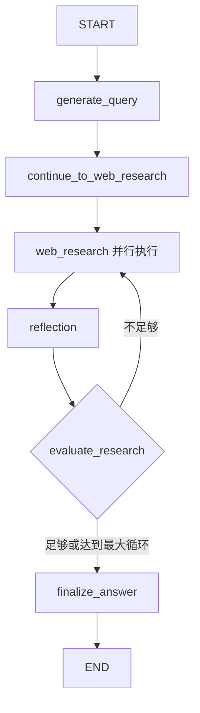

# GStack-LangGraph 项目分析报告

## 1. 项目概览

### 1.1 项目基本信息
- **项目名称**: Gemini Fullstack LangGraph Quickstart
- **主要功能**: 基于LangGraph的研究代理，集成Google Gemini模型和Google Search API
- **架构模式**: 前后端分离的全栈应用
- **开发语言**: Python (后端) + TypeScript/React (前端)

### 1.2 核心特性
- 💬 React前端 + LangGraph后端的全栈架构
- 🧠 基于LangGraph的高级研究和对话AI代理
- 🔍 动态搜索查询生成，使用Google Gemini模型
- 🌐 通过Google Search API集成Web研究
- 🤔 反思推理识别知识盲点并优化搜索
- 📄 生成带引用的答案
- 🔄 开发模式下前后端热重载

---

## 2. 技术架构分析

### 2.1 前端架构 (Frontend)

#### 技术栈
```json
{
  "框架": "React 19.0.0 + TypeScript",
  "构建工具": "Vite 6.3.4",
  "UI组件": "Radix UI + Tailwind CSS 4.1.5",
  "状态管理": "内置React hooks",
  "LangGraph集成": "@langchain/langgraph-sdk 0.0.74"
}
```

#### 核心组件结构
```
frontend/src/
├── App.tsx              # 主应用组件，流式数据处理
├── components/
│   ├── ActivityTimeline.tsx     # 活动时间线
│   ├── ChatMessagesView.tsx     # 聊天消息视图
│   ├── InputForm.tsx           # 输入表单
│   ├── WelcomeScreen.tsx       # 欢迎屏幕
│   └── ui/                     # UI基础组件库
│       ├── badge.tsx
│       ├── button.tsx
│       ├── card.tsx
│       └── ...
└── lib/
    └── utils.ts               # 工具函数
```

#### 关键功能特性
1. **流式数据处理**: 使用 `@langchain/langgraph-sdk` 的 `useStream` hook
2. **实时事件监听**: 监听后端执行的各个阶段 (查询生成、Web研究、反思、最终答案)
3. **配置化**: 支持研究强度配置 (low/medium/high)
4. **响应式设计**: 基于Tailwind CSS的现代UI

### 2.2 后端架构 (Backend)

#### 技术栈
```python
{
    "框架": "LangGraph + FastAPI",
    "LLM": "Google Gemini (google-genai + langchain-google-genai)",
    "搜索API": "Google Search API",
    "配置管理": "python-dotenv",
    "依赖版本": {
        "langgraph": ">=0.2.6",
        "langchain": ">=0.3.19",
        "fastapi": "latest"
    }
}
```

#### 核心模块结构
```
backend/src/agent/
├── __init__.py
├── app.py                 # FastAPI应用入口
├── configuration.py       # 配置管理
├── graph.py              # LangGraph核心图定义
├── prompts.py            # 提示词模板
├── state.py              # 状态管理
├── tools_and_schemas.py  # 工具和数据模式
└── utils.py              # 工具函数
```

#### LangGraph工作流程


#### 核心节点功能
1. **generate_query**: 基于用户问题生成初始搜索查询
2. **web_research**: 并行执行Web搜索，获取相关信息
3. **reflection**: 分析搜索结果，识别知识盲点
4. **evaluate_research**: 决定是否继续搜索或生成最终答案
5. **finalize_answer**: 整合信息生成带引用的最终答案

### 2.3 接口层分析

#### API接口设计
- **LangGraph API**: 后端通过LangGraph提供标准的图执行API
- **流式响应**: 支持实时流式数据传输
- **前端集成**: 通过 `@langchain/langgraph-sdk` 无缝对接

#### 数据流模式
```
用户输入 → 前端验证 → LangGraph API调用 → 后端图执行 → 流式返回 → 前端实时更新
```

#### 配置参数
- `initial_search_query_count`: 初始搜索查询数量
- `max_research_loops`: 最大研究循环次数  
- `reasoning_model`: 推理模型选择

---

## 3. 当前根目录版本后端架构分析

### 3.1 xDAN系统概览
```python
{
    "项目名称": "xDAN-Agentic-Search-Test",
    "版本": "0.1.0", 
    "核心功能": "高级智能体MCP集成系统",
    "主要特性": [
        "智能工具选择器",
        "多轮工具调用",
        "并行执行优化",
        "MCP协议集成"
    ]
}
```

### 3.2 核心模块架构
```
intelligent_tool_selector/
├── core/
│   ├── selector.py              # 基础工具选择器
│   ├── multi_turn_selector.py   # 多轮工具选择器  
│   ├── parallel_executor.py     # 并行执行管理器
│   └── json_parser.py          # JSON解析器
├── utils/
│   ├── config.py               # 配置管理
│   └── mcp_client.py           # MCP客户端管理
└── examples/
    ├── basic_usage.py          # 基础使用示例
    └── multi_turn_usage.py     # 多轮使用示例
```

### 3.3 技术特性对比

| 特性维度 | gstack-langgraph | xDAN根目录版本 |
|---------|------------------|---------------|
| **执行模式** | 图式工作流 | 智能工具选择 |
| **并发能力** | LangGraph并行节点 | 专用并行执行器 |
| **工具集成** | Google Search专用 | MCP协议通用 |
| **多轮支持** | 反思循环 | 任务规划分解 |
| **前端集成** | LangGraph SDK | 无现成前端 |

---

## 4. 前后端对接可行性评估

### 4.1 兼容性分析

#### ✅ 高兼容性方面
1. **接口模式**: 两者都支持流式API调用
2. **数据格式**: 都使用JSON格式的消息传递
3. **异步架构**: 都基于Python异步编程
4. **配置化**: 都支持参数化配置

#### ⚠️ 需要适配的方面
1. **API端点**: gstack前端期望LangGraph特定的API格式
2. **事件类型**: 前端监听特定的事件名称（generate_query、web_research等）
3. **状态管理**: 两套系统的状态结构不同
4. **消息格式**: LangGraph消息格式与xDAN格式存在差异

### 4.2 对接方案设计

#### 方案A: 适配器模式 (推荐)
创建一个适配器层，将xDAN后端包装为LangGraph兼容的API：

```python
# 适配器伪代码示例
class XDANToLangGraphAdapter:
    def __init__(self, xdan_selector):
        self.xdan_selector = xdan_selector
    
    async def stream_execution(self, query, config):
        # 将LangGraph格式的请求转换为xDAN格式
        # 执行xDAN逻辑
        # 将xDAN事件转换为LangGraph格式事件流
        pass
```

#### 方案B: 前端重构
基于gstack前端组件，重新设计适配xDAN后端的前端：

```typescript
// 新的API客户端
const xdanApiClient = {
  async streamQuery(query: string, options: XDANOptions) {
    // 调用xDAN后端API
    // 转换事件格式
  }
}
```

### 4.3 具体实施建议

#### 步骤1: 后端适配层开发
1. 创建 `xdan_langgraph_adapter.py`
2. 实现LangGraph API兼容接口
3. 将xDAN执行事件转换为前端期望的格式

#### 步骤2: 前端组件复用
1. 复制 `gstack-langgraph/frontend` 到新目录
2. 修改API调用地址和事件处理逻辑
3. 保持UI组件不变，只调整数据层

#### 步骤3: 事件映射定义
```javascript
const eventMapping = {
  'tool_selection': 'generate_query',
  'tool_execution': 'web_research', 
  'multi_turn_planning': 'reflection',
  'result_integration': 'finalize_answer'
}
```

---

## 5. 实施计划与建议

### 5.1 技术可行性: ⭐⭐⭐⭐⭐ (95%)

**优势**:
- 两套系统都基于现代Python异步架构
- 前端组件设计良好，高度可复用
- xDAN后端功能更强大，支持更多工具类型
- 适配工作量可控，主要在API层面

**挑战**:
- 需要深入理解两套系统的事件和状态模型
- 可能需要调整部分前端组件的状态管理逻辑

### 5.2 推荐实施路径

#### Phase 1: 环境准备 (1-2天)
- [ ] 复制gstack前端代码到项目根目录
- [ ] 安装和配置依赖环境
- [ ] 创建适配器模块结构

#### Phase 2: 后端适配开发 (3-5天)  
- [ ] 开发xDAN到LangGraph的API适配器
- [ ] 实现事件流转换逻辑
- [ ] 添加配置映射和参数转换

#### Phase 3: 前端集成调试 (2-3天)
- [ ] 修改前端API调用配置
- [ ] 调试事件监听和状态更新
- [ ] 优化UI交互体验

#### Phase 4: 测试和优化 (2-3天)
- [ ] 端到端功能测试
- [ ] 性能优化和错误处理
- [ ] 文档编写和部署配置

### 5.3 预期效果
通过对接，可以获得：
1. **丰富的前端UI**: 专业的聊天界面和活动时间线
2. **强大的后端能力**: xDAN的多工具支持和智能选择
3. **最佳用户体验**: 流式响应和实时状态反馈
4. **可扩展架构**: 便于后续功能扩展和定制

---

## 6. 总结

gstack-langgraph项目提供了一个完整的前后端解决方案，其前端部分设计精良，完全可以与当前根目录的xDAN后端系统对接。通过适配器模式，可以在保持前端用户体验的同时，充分利用xDAN后端的强大功能。

**核心价值**:
- 复用优秀的前端组件和交互设计
- 整合xDAN的多工具智能选择能力  
- 实现更完善的全栈AI应用体验

建议优先实施适配器方案，该方案风险最低，收益最大，可以快速获得一个功能完整的AI研究助手应用。